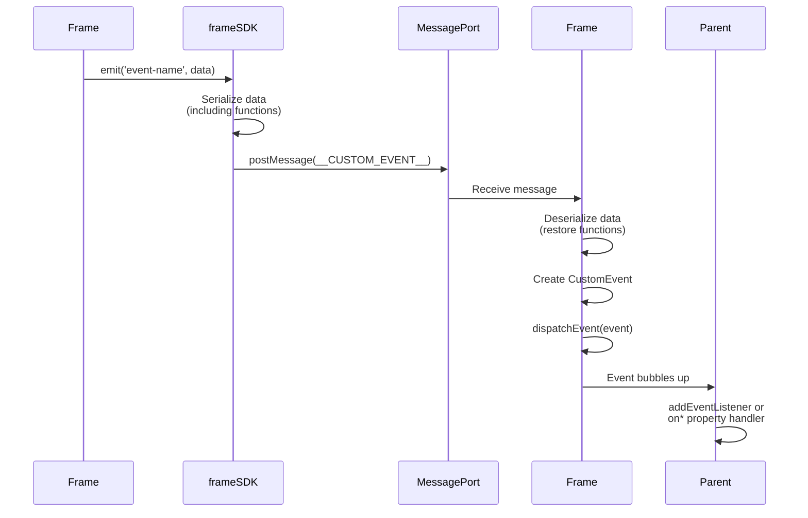
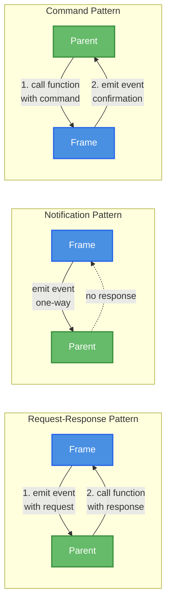

# Event System

Frame provides a bidirectional event system for communication between parent and frame.

## Frame -> Parent Events

### Event Emission Flow

The following diagram illustrates the complete flow of an event from frame to parent:



### Emitting Events

```typescript
import { frameSDK } from '@zomme/frame/sdk';

// Emit event without data
frameSDK.emit('ready');

// Emit event with data
frameSDK.emit('user-selected', { userId: 123 });

// Emit event with complex data
frameSDK.emit('form-submitted', {
  values: { name: 'John', email: 'john@example.com' },
  timestamp: Date.now(),
});
```

### Listening in Parent

Events are dispatched as DOM CustomEvents:

```typescript
const frame = document.querySelector('z-frame');

// Listen to specific event
frame.addEventListener('user-selected', (event) => {
  console.log('User selected:', event.detail.userId);
});

// Listen to form-submitted
frame.addEventListener('form-submitted', (event) => {
  console.log('Form values:', event.detail.values);
  console.log('Timestamp:', event.detail.timestamp);
});
```

### Property Handlers

You can also use property handlers:

```typescript
const frame = document.querySelector('z-frame');

// Property handler (on + eventName)
frame.onuserselected = (detail) => {
  console.log('User selected:', detail.userId);
};

frame.onformsubmitted = (detail) => {
  console.log('Form values:', detail.values);
};
```

> [!NOTE]
> Property handlers normalize event names by removing `-`, `:`, `.` characters.

## Parent -> Frame Events

### Bidirectional Event Flow

The Frame architecture supports multiple communication patterns:

```mermaid
graph TB
    subgraph Parent
        P[Parent App]
    end

    subgraph FrameComponent
        FF[Frame Element]
    end

    subgraph FrameApp
        F[Frame App]
        SDK[frameSDK]
    end

    F -->|1. Custom Events<br/>via __CUSTOM_EVENT__| SDK
    SDK -->|MessagePort| FF
    FF -->|CustomEvent| P

    P -->|2. Attribute Changes<br/>frame.prop = value| FF
    FF -->|__ATTRIBUTE_CHANGE__<br/>via MessagePort| SDK
    SDK -->|trigger watch handlers| F

    P -->|3. Function Calls<br/>frame.method()| FF
    FF -->|__FUNCTION_CALL__<br/>via MessagePort| SDK
    SDK -->|execute & return| F

    style F fill:#4A90E2,stroke:#2563EB,stroke-width:2px,color:#fff
    style P fill:#66BB6A,stroke:#388E3C,stroke-width:2px,color:#fff
    style FF fill:#AB47BC,stroke:#7B1FA2,stroke-width:2px,color:#fff
    style SDK fill:#4A90E2,stroke:#2563EB,stroke-width:2px,color:#fff
```

### Sending Events from Parent

While not built-in, you can use parent-provided functions:

```typescript
// Parent provides event emitter via props
frame.parentEvents = {
  emit: (eventName, data) => {
    // Handle event in parent
    console.log(`Parent event: ${eventName}`, data);
  },
};

// Frame listens and emits back
frameSDK.on('parent-event', (data) => {
  console.log('Received from parent:', data);
});
```

Better approach - use property watching:

```typescript
// Parent changes property
frame.currentUser = { id: 123, name: 'John' };

// Frame watches property changes
const unwatch = frameSDK.watch(['currentUser'], (changes) => {
  if ('currentUser' in changes && changes.currentUser) {
    const [newUser, oldUser] = changes.currentUser;
    console.log('User changed from:', oldUser, 'to:', newUser);
    updateUI(newUser);
  }
});

// Cleanup when done
unwatch();
```

## Built-in Events

### `ready` Event

Emitted when frame is initialized:

```typescript
frame.addEventListener('ready', () => {
  console.log('Frame is ready');
  // Safe to interact with frame now
});
```

## Event Naming

### Naming Conventions

Use descriptive, kebab-case names:

* ✅ `user-selected`, `form-submitted`, `data-loaded`
* ❌ `userSelected`, `formSubmitted`, `dataLoaded` (camelCase - harder to read in HTML)
* ❌ `click`, `submit` (too generic)

### Namespace Events

For complex applications, use namespaces:

```typescript
// User-related events
frameSDK.emit('user:login', { userId: 123 });
frameSDK.emit('user:logout');
frameSDK.emit('user:profile-updated', { name: 'John' });

// Form-related events
frameSDK.emit('form:submit', { values: {...} });
frameSDK.emit('form:reset');
frameSDK.emit('form:validation-error', { field: 'email', error: 'Invalid' });

// Data-related events
frameSDK.emit('data:loaded', { items: [...] });
frameSDK.emit('data:error', { message: 'Failed to load' });
```

Parent can listen with event name filtering:

```typescript
frame.addEventListener('user:login', (e) => { ... });
frame.addEventListener('user:logout', (e) => { ... });
```

## Event Data

### Simple Data

```typescript
frameSDK.emit('counter-updated', 42);
frameSDK.emit('status-changed', 'active');
frameSDK.emit('toggle-changed', true);
```

### Complex Objects

```typescript
frameSDK.emit('user-updated', {
  id: 123,
  name: 'John Doe',
  email: 'john@example.com',
  roles: ['admin', 'editor'],
  metadata: {
    lastLogin: new Date().toISOString(),
    loginCount: 42,
  },
});
```

### Functions in Events

Events can include functions:

```typescript
frameSDK.emit('action-registered', {
  name: 'refresh',
  execute: () => {
    console.log('Refreshing...');
    loadData();
  },
});

// Parent receives and can call the function
frame.addEventListener('action-registered', (event) => {
  const { name, execute } = event.detail;
  console.log(`Registered action: ${name}`);

  // Call frame function
  execute();
});
```

### Transferable Objects

Events support transferable objects:

```typescript
const buffer = new ArrayBuffer(1024);
frameSDK.emit('data-ready', { buffer });

// buffer is now transferred to parent (unusable in frame)
```

## Event Patterns

The Frame supports three primary communication patterns, each suited for different use cases:



> [!NOTE]
> **Request-Response** uses events + functions, **Notification** uses events only, **Command** uses functions + events for confirmation.

### Request-Response Pattern

Frame requests data from parent:

```typescript
// Frame emits request
frameSDK.emit('fetch-user-data', { userId: 123 });

// Watch for response via property changes
const unwatch = frameSDK.watch(['userData'], (changes) => {
  if ('userData' in changes && changes.userData) {
    const [newData] = changes.userData;
    console.log('Received user data:', newData);
    unwatch(); // Stop watching after receiving data
  }
});

// Parent handles request
frame.addEventListener('fetch-user-data', async (event) => {
  const { userId } = event.detail;
  const userData = await api.getUser(userId);

  // Send response via attribute
  frame.userData = userData;
});
```

### Notification Pattern

Frame notifies parent of state changes:

```typescript
// Frame notifies
frameSDK.emit('loading', true);

// ... do work

frameSDK.emit('loading', false);
frameSDK.emit('data-loaded', { items });

// Parent updates UI
frame.addEventListener('loading', (event) => {
  const isLoading = event.detail;
  showSpinner(isLoading);
});

frame.addEventListener('data-loaded', (event) => {
  console.log('Loaded items:', event.detail.items);
});
```

### Command Pattern

Parent sends commands to frame:

```typescript
// Parent sends command via function
frame.executeCommand = async (command) => {
  switch (command.type) {
    case 'refresh':
      await loadData();
      break;
    case 'save':
      await saveData(command.data);
      break;
    case 'reset':
      resetForm();
      break;
  }
};

// Frame executes
await frameSDK.props.executeCommand({ type: 'refresh' });
await frameSDK.props.executeCommand({ type: 'save', data: {...} });
```

## Error Events

### Emitting Errors

```typescript
try {
  await riskyOperation();
} catch (error) {
  frameSDK.emit('error', {
    message: error.message,
    stack: error.stack,
    context: 'user-form',
  });
}
```

### Handling Errors in Parent

```typescript
frame.addEventListener('error', (event) => {
  const { message, stack, context } = event.detail;

  console.error(`Error in ${context}:`, message);

  // Log to error tracking service
  errorTracker.log({
    message,
    stack,
    frame: frame.getAttribute('name'),
  });

  // Show user-friendly message
  showToast('Something went wrong. Please try again.');
});
```

## Best Practices

### Use Events for Notifications

Events are best for fire-and-forget notifications:

```typescript
// ✅ Good: One-way notification
frameSDK.emit('user-clicked-button', { buttonId: 'save' });

// ❌ Bad: Should use function for request-response
frameSDK.emit('get-user-data', { userId: 123 });
// How do you get the response?
```

### Use Functions for Request-Response

```typescript
// ✅ Good: Function returns response
const userData = await frameSDK.props.getUserData(123);

// ❌ Bad: Event doesn't return anything
frameSDK.emit('get-user-data', { userId: 123 });
```

### Document Your Events

```typescript
/**
 * Events emitted by UserForm frame:
 *
 * - user:selected - When user is selected
 *   detail: { userId: number, userName: string }
 *
 * - form:submitted - When form is submitted
 *   detail: { values: Record<string, unknown> }
 *
 * - form:cancelled - When form is cancelled
 *   detail: undefined
 *
 * - error - When an error occurs
 *   detail: { message: string, context: string }
 */
```

### Namespace Your Events

Avoid name collisions:

```typescript
// ✅ Good: Namespaced
frameSDK.emit('userform:submit', data);
frameSDK.emit('userform:cancel');

// ❌ Bad: Generic names might conflict
frameSDK.emit('submit', data);
frameSDK.emit('cancel');
```

### Keep Event Data Serializable

Avoid non-serializable objects like DOM nodes. Circular references are automatically handled:

```typescript
// ✅ Good: Simple, serializable
frameSDK.emit('data-loaded', {
  items: [...],
  count: 42,
  timestamp: Date.now(),
});

// ✅ Good: Circular references are preserved automatically
const obj = { name: 'test' };
obj.self = obj;
frameSDK.emit('circular-data', obj); // Works fine!

// ❌ Bad: DOM nodes cannot be serialized
const form = document.querySelector('form');
frameSDK.emit('form-ready', { form }); // Won't serialize
```

### Cleanup Event Listeners

Always remove event listeners:

```typescript
const handleUserSelected = (event) => {
  console.log(event.detail);
};

frame.addEventListener('user-selected', handleUserSelected);

// Later...
frame.removeEventListener('user-selected', handleUserSelected);
```
