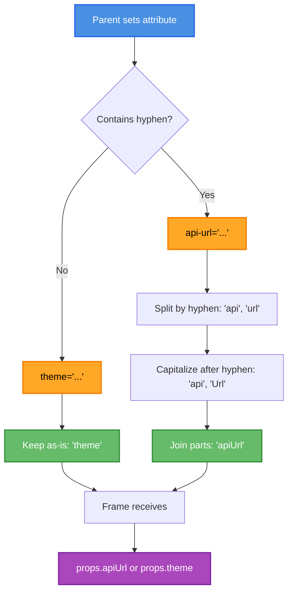
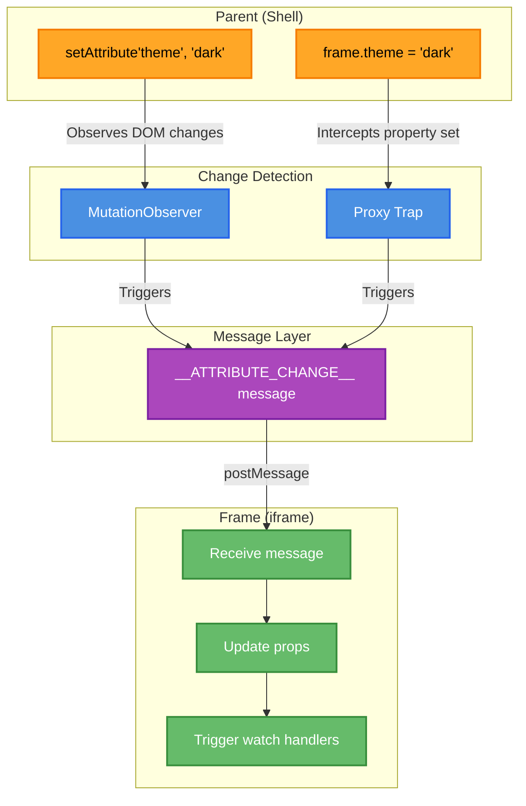
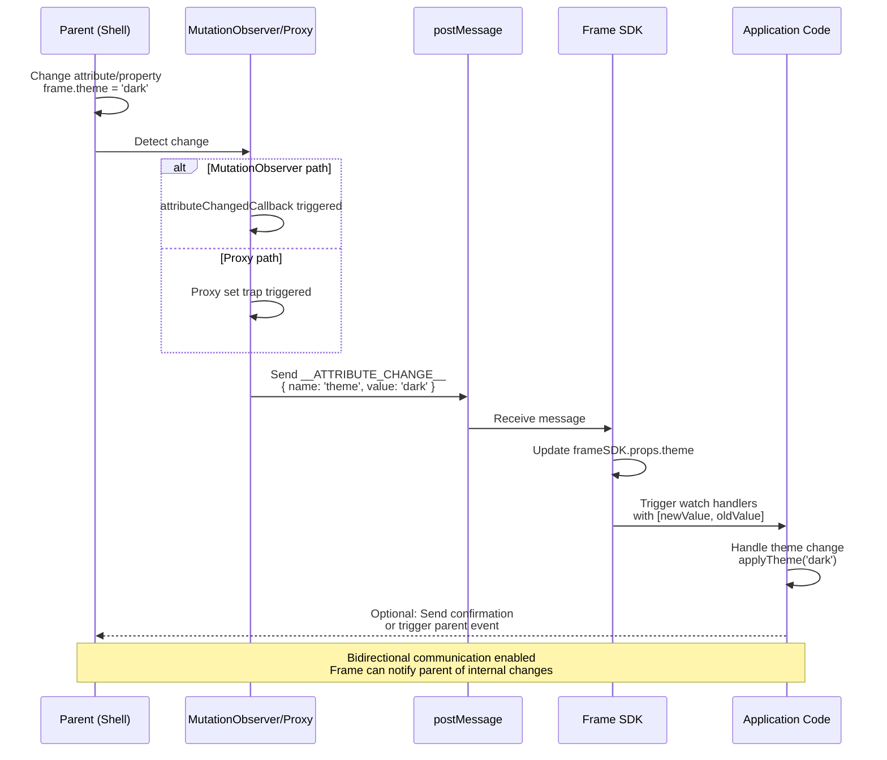

# Attributes and Properties

Frame supports both HTML attributes and JavaScript properties for passing data to frames.

## Attribute Types

### Fixed Attributes

These control the frame instance and are read only once:

| Attribute | Purpose | Required |
|-----------|---------|----------|
| `name` | Frame identifier, used as default base path | Yes |
| `src` | Frame URL (must include protocol) | Yes |
| `base` | Base path for frame router | No (defaults to `/${name}`) |
| `sandbox` | iframe sandbox permissions | No (has secure defaults) |

**Important:** Fixed attributes are **not reactive**. Changing them after initialization has no effect.

```html
<z-frame
  name="my-app"
  src="http://localhost:3000"
  base="/custom-path"
  sandbox="allow-scripts allow-same-origin"
></z-frame>
```

### Dynamic Attributes

Any other attribute is passed to the frame and is **reactive**:

```html
<z-frame
  name="my-app"
  src="http://localhost:3000"
  api-url="https://api.example.com"
  theme="dark"
  user-id="123"
></z-frame>
```

Frame receives (kebab-case converted to camelCase):

```typescript
{
  name: "my-app",
  base: "/my-app",
  apiUrl: "https://api.example.com",
  theme: "dark",
  userId: "123"
}
```

## Properties vs Attributes

### Attributes (HTML)

* Limited to **strings** only
* Set via `setAttribute()` or HTML markup
* Use kebab-case naming: `api-url`, `user-id`

```html
<z-frame api-url="https://api.example.com"></z-frame>
```

```typescript
frame.setAttribute('theme', 'dark');
```

### Properties (JavaScript)

* Support **any type**: objects, arrays, functions, etc.
* Set via direct property assignment
* Use camelCase naming: `apiUrl`, `userId`

```typescript
const frame = document.querySelector('z-frame');

// Complex objects
frame.userData = { name: 'John', role: 'admin' };

// Arrays
frame.permissions = ['read', 'write'];

// Functions
frame.onUserClick = (data) => {
  console.log('User clicked:', data);
};
```

**Recommendation:** Use properties for complex data, attributes for simple configuration.

## Attribute Name Conversion

Attribute names are automatically converted:

| HTML Attribute | Property Name | Frame Receives |
|----------------|---------------|----------------|
| `api-url` | `apiUrl` | `apiUrl` |
| `user-id` | `userId` | `userId` |
| `data-theme` | `dataTheme` | `dataTheme` |
| `theme` | `theme` | `theme` |

**Rules:**

1. Hyphens are removed
2. Character after hyphen is uppercased
3. Result is camelCase

### Conversion Pipeline

The following diagram shows how attribute names are converted from HTML to JavaScript:



**Conversion Examples:**

* `api-url` → Split: [`api`, `url`] → Capitalize: [`api`, `Url`] → Join: `apiUrl`
* `user-id` → Split: [`user`, `id`] → Capitalize: [`user`, `Id`] → Join: `userId`
* `data-theme` → Split: [`data`, `theme`] → Capitalize: [`data`, `Theme`] → Join: `dataTheme`
* `theme` → No hyphen → Keep as-is: `theme`

## Change Detection

Frame uses **two mechanisms** to detect changes:

### MutationObserver (Attributes)

Detects changes via `setAttribute()`:

```typescript
// Detected by MutationObserver
frame.setAttribute('theme', 'dark');
```

```text
setAttribute() → MutationObserver → __ATTRIBUTE_CHANGE__ message → Frame
```

### Proxy (Properties)

Detects changes via property assignment:

```typescript
// Detected by Proxy
frame.theme = 'dark';
frame.userData = { name: 'John' };
```

```text
Property set → Proxy trap → __ATTRIBUTE_CHANGE__ message → Frame
```

> [!TIP]
> Both mechanisms work transparently. Use whichever is more convenient.

### Detection Architecture

The following diagram illustrates how both detection mechanisms work in parallel:



**Key Points:**

* **Path 1 (MutationObserver):** Monitors DOM attribute changes via `setAttribute()`
* **Path 2 (Proxy):** Intercepts JavaScript property assignments
* **Convergence:** Both paths send the same `__ATTRIBUTE_CHANGE__` message
* **Result:** Frame receives updates regardless of how they were made

## Reactive Updates

When an attribute/property changes, the frame is notified:

```typescript
// Parent changes theme
frame.theme = 'dark';

// Frame receives update via watch
const unwatch = frameSDK.watch(['theme'], (changes) => {
  if ('theme' in changes && changes.theme) {
    const [newTheme, oldTheme] = changes.theme;
    console.log(`Theme changed from ${oldTheme} to ${newTheme}`);
    applyTheme(newTheme);
  }
});

// Cleanup when done
unwatch();
```

**Update flow:**

1. Parent changes attribute/property
2. Change detected (MutationObserver or Proxy)
3. `__ATTRIBUTE_CHANGE__` message sent to frame
4. Frame SDK updates `frameSDK.props`
5. Frame SDK triggers watch handlers with `[newValue, oldValue]`
6. Application code reacts to change

### Update Flow Sequence

The following sequence diagram shows the complete reactive update flow:



**Flow Details:**

1. **Parent Action:** Attribute or property is changed
2. **Detection:** Either MutationObserver (DOM) or Proxy (JavaScript) detects the change
3. **Message Sent:** `__ATTRIBUTE_CHANGE__` message posted to iframe
4. **SDK Updates:** Frame SDK updates its internal `props` object
5. **Watch Handlers:** SDK triggers watch handlers with `[newValue, oldValue]` tuple
6. **Application Response:** Frame application code handles the change
7. **Optional Feedback:** Frame can send events back to parent if needed

> [!TIP]
> The frame can also emit events back to the parent using `frameSDK.emit()`, creating true bidirectional communication.

## Initial vs Dynamic Values

### Initial Values

Set before frame is ready:

```typescript
const frame = document.createElement('z-frame');
frame.setAttribute('name', 'my-app');
frame.setAttribute('src', 'http://localhost:3000');
frame.theme = 'dark';          // Queued
frame.apiUrl = 'https://api.com'; // Queued

document.body.appendChild(frame);
```

These values are collected and sent in the `__INIT__` message.

### Dynamic Updates

Set after frame is ready:

```typescript
frame.addEventListener('ready', () => {
  // Frame is ready, updates sent immediately
  frame.theme = 'light';
  frame.permissions = ['read', 'write', 'delete'];
});
```

Each change sends an `__ATTRIBUTE_CHANGE__` message.

## Best Practices

### Use Attributes for Configuration

Simple, string-based configuration:

```html
<z-frame
  name="my-app"
  src="http://localhost:3000"
  environment="production"
  api-version="v2"
></z-frame>
```

### Use Properties for Complex Data

Objects, arrays, functions:

```typescript
frame.config = {
  api: { baseUrl: 'https://api.com', timeout: 5000 },
  features: ['feature-a', 'feature-b'],
  theme: { mode: 'dark', primary: '#007bff' }
};

frame.onDataChange = (data) => {
  console.log('Data updated:', data);
};
```

### Avoid Frequent Updates

Debounce rapid changes:

```typescript
// BAD: Sends 1000 messages
for (let i = 0; i < 1000; i++) {
  frame.counter = i;
}

// GOOD: Batch updates
let counter = 0;
const interval = setInterval(() => {
  frame.counter = counter++;
  if (counter >= 1000) clearInterval(interval);
}, 100);
```

### Watch Specific Properties

Use `watch()` for targeted property watching:

```typescript
// Watch theme changes only
const unwatchTheme = frameSDK.watch(['theme'], (changes) => {
  if ('theme' in changes && changes.theme) {
    const [newTheme] = changes.theme;
    applyTheme(newTheme);
  }
});

// Watch API URL changes only
const unwatchApi = frameSDK.watch(['apiUrl'], (changes) => {
  if ('apiUrl' in changes && changes.apiUrl) {
    const [newUrl] = changes.apiUrl;
    updateApiClient(newUrl);
  }
});

// Cleanup when done
unwatchTheme();
unwatchApi();
```

## Function Properties

Functions can be passed as properties for callbacks:

```typescript
// Parent provides callbacks
frame.onSave = async (data) => {
  await api.save(data);
  return { success: true };
};

frame.onCancel = () => {
  router.back();
};

// Frame calls them
const result = await frameSDK.props.onSave({ name: 'John' });
console.log(result); // { success: true }

frameSDK.props.onCancel();
```

**Naming convention:** Use `on*` prefix for event handlers:

* `onSave`, `onCancel`, `onLoad`
* `onUserClick`, `onDataChange`
* `onError`, `onSuccess`

> [!TIP]
> Functions have a 5-second timeout. For long operations, return a Promise and resolve it when done.
