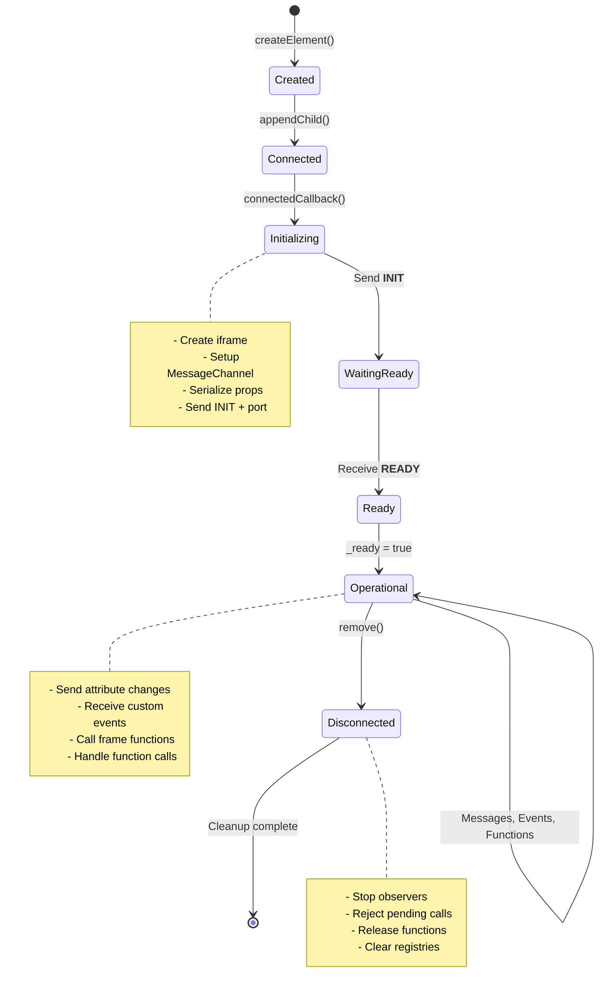
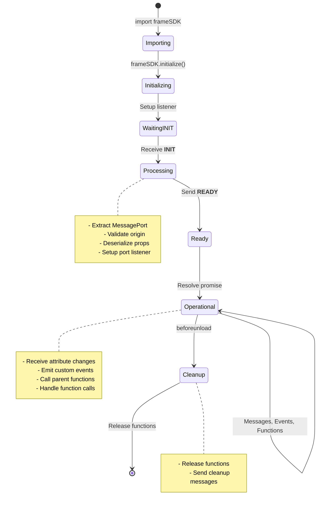
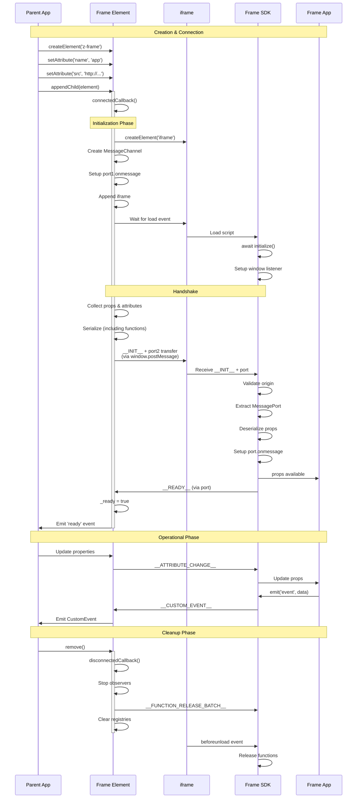

# Lifecycle

Frame has a well-defined lifecycle from creation to cleanup.

## Frame Lifecycle (Parent)

### 1. Creation

Element is created in JavaScript or HTML:

```typescript
const frame = document.createElement('z-frame');
frame.setAttribute('name', 'my-app');
frame.setAttribute('src', 'http://localhost:3000');
```

**State:** Element exists but not initialized

### 2. Connection (connectedCallback)

Element is added to the DOM:

```typescript
document.body.appendChild(frame);
// connectedCallback() is triggered
```

**Actions:**

* Read fixed attributes (`name`, `src`, `base`, `sandbox`)
* Validate required attributes
* Calculate `_origin` from URL
* Call `initializeApp()`

### 3. Initialization

**Actions:**

1. Create iframe element:
   ```typescript
   this._iframe = document.createElement('iframe');
   this._iframe.src = src;
   this._iframe.setAttribute('sandbox', sandbox);
   ```

2. Create MessageChannel:
   ```typescript
   const channel = new MessageChannel();
   ```

3. Setup message listener on port:
   ```typescript
   channel.port1.onmessage = this.handleMessageFromIframe;
   ```

4. Append iframe to element:
   ```typescript
   this.appendChild(this._iframe);
   ```

5. Wait for iframe load:
   ```typescript
   await new Promise(resolve => this._iframe.onload = resolve);
   ```

6. Collect attributes and properties

7. Serialize props (including functions):
   ```typescript
   const { serialized, transferables } = this.serializeValue(props);
   ```

8. Send `__INIT__` message via window.postMessage with MessagePort:
   ```typescript
   this._iframe.contentWindow.postMessage(
     { type: '__INIT__', payload: serialized },
     this._origin,
     [channel.port2]  // Transfer port to frame
   );
   ```

9. Setup MutationObserver for attribute changes:
   ```typescript
   this._mutationObserver = new MutationObserver(mutations => {
     // Handle attribute changes
   });
   ```

**State:** Waiting for frame to be ready

### 4. Ready

Frame sends `__READY__` message:

```typescript
case '__READY__':
  this._ready = true;
  this.emit('ready');
  break;
```

**Actions:**

* Set `_ready` flag to `true`
* Emit `ready` event
* Enable attribute change propagation

**State:** Fully operational, bidirectional communication enabled

### 5. Operation

Normal operation with message handling:

* Receive custom events from frame
* Handle function calls from frame
* Send attribute changes to frame
* Call functions provided by frame

### 6. Disconnection (disconnectedCallback)

Element is removed from DOM:

```typescript
frame.remove();
// disconnectedCallback() is triggered
```

**Actions:**

1. Stop MutationObserver:
   ```typescript
   this._mutationObserver?.disconnect();
   ```

2. Remove iframe:
   ```typescript
   this._iframe?.remove();
   ```

3. Reject pending function calls:
   ```typescript
   for (const [_, pending] of this._pendingFunctionCalls) {
     clearTimeout(pending.timeout);
     pending.reject(new Error('Web Component disconnected'));
   }
   ```

4. Send batch function release message:
   ```typescript
   const functionIds = Array.from(this._manager?.getTrackedFunctions() || []);
   if (functionIds.length > 0) {
     this._sendToIframe({
       type: '__FUNCTION_RELEASE_BATCH__',
       fnIds: functionIds
     });
   }
   ```

5. Clear registries:
   ```typescript
   this._functionRegistry.clear();
   this._trackedFunctions.clear();
   this._pendingFunctionCalls.clear();
   ```

**State:** Cleaned up, resources released

## Frame SDK Lifecycle (Child)

### 1. Import and Initialize

Frame app imports and initializes SDK:

```typescript
import { frameSDK } from '@zomme/frame/sdk';

// Must be called first
await frameSDK.initialize();
```

**State:** Waiting for `__INIT__` message

### 2. Initialization

SDK receives `__INIT__` message:

**Actions:**

1. Receive `__INIT__` via window.postMessage (one-time):
   ```typescript
   window.addEventListener('message', (event) => {
     if (event.data.type === '__INIT__') {
       // Extract MessagePort from event.ports[0]
       this._port = event.ports[0];
     }
   }, { once: true });
   ```

2. Setup message listener on MessagePort:
   ```typescript
   this._port.onmessage = this.handleMessage.bind(this);
   ```

3. Validate parent origin (optional):
   ```typescript
   if (expectedOrigin && event.origin !== expectedOrigin) {
     throw new Error('Origin validation failed');
   }
   ```

4. Deserialize props (including functions from parent):
   ```typescript
   this.props = this.deserializeValue(message.payload);
   ```

5. Setup cleanup on unload:
   ```typescript
   window.addEventListener('beforeunload', () => {
     // Send batch function release message
   });
   ```

6. Send `__READY__` message via MessagePort:
   ```typescript
   this._port.postMessage({ type: '__READY__' });
   ```

7. Resolve initialization promise

**State:** Ready for operation

### 3. Operation

Normal operation:

* Receive attribute changes
* Receive events from parent
* Emit custom events to parent
* Call functions from parent (via props)
* Provide functions to parent (via props or return values)

### 4. Cleanup (beforeunload)

Browser is closing or navigating away:

**Actions:**

1. Send batch function release message:
   ```typescript
   const functionIds = Array.from(this.trackedFunctions);
   if (functionIds.length > 0) {
     this._port.postMessage({
       type: '__FUNCTION_RELEASE_BATCH__',
       fnIds: functionIds
     });
   }
   ```

**State:** Resources released

## Lifecycle Diagram

### Parent State Machine



### Frame SDK State Machine



### Complete Initialization Sequence



## Timing Considerations

### Race Condition Window

```mermaid
gantt
    title Frame Lifecycle Timing
    dateFormat X
    axisFormat %L

    section Parent
    Create element           :0, 10
    Add to DOM              :10, 20
    connectedCallback()     :20, 30
    Create iframe           :30, 40
    Send __INIT__           :40, 50
    Waiting for __READY__   :crit, 50, 100
    Receive __READY__       :milestone, 100, 100
    Operational             :active, 100, 200

    section Frame
    iframe loads            :60, 70
    SDK initialize()        :70, 80
    Receive __INIT__        :80, 90
    Setup & deserialize     :90, 100
    Send __READY__          :milestone, 100, 100
    Operational             :active, 100, 200

    section Unsafe Window
    Unsafe operations       :crit, 20, 100
    Safe operations         :active, 100, 200
```



> [!NOTE]
> The red "Unsafe Window" represents the period where the frame is not yet ready. Operations during this time will fail or be queued.

### Before Ready

Operations attempted before the frame is ready will fail or be ignored:

```typescript
const frame = document.createElement('z-frame');
frame.setAttribute('name', 'my-app');
frame.setAttribute('src', 'http://localhost:3000');

// These changes are queued and sent in INIT message
frame.theme = 'dark';
frame.apiUrl = 'https://api.com';

document.body.appendChild(frame);

// This will fail - frame not ready yet
try {
  await frame.onSave?.(); // Error: Frame not ready
} catch (err) {
  console.error(err);
}

// Wait for ready event
frame.addEventListener('ready', () => {
  // Now operations will work
  frame.onSave?.(); // Works
});
```

### Initialization Race Conditions

To avoid race conditions, always wait for the `ready` event:

```typescript
// BAD: May execute before frame is ready
const frame = document.querySelector('z-frame');
frame.userData = currentUser;

// GOOD: Wait for ready
const frame = document.querySelector('z-frame');
frame.addEventListener('ready', () => {
  frame.userData = currentUser;
});
```

Or use promises:

```typescript
const frame = document.querySelector('z-frame');

await new Promise(resolve => {
  if (frame._ready) {
    resolve();
  } else {
    frame.addEventListener('ready', resolve, { once: true });
  }
});

// Frame is ready
frame.userData = currentUser;
```

## Best Practices

### Initialize SDK First Thing

```typescript
// At the top of your frame entry point
import { frameSDK } from '@zomme/frame/sdk';

await frameSDK.initialize();

// Now safe to access props
console.log('Frame name:', frameSDK.props.name);
```

### Wait for Ready in Parent

```typescript
frame.addEventListener('ready', () => {
  // Call functions
  frame.onInit?.();

  // Send events
  frame.emit('user-logged-in', user);

  // Update properties
  frame.userData = user;
});
```

### Cleanup Resources

Frame applications should clean up on unload:

```typescript
// Close connections
window.addEventListener('beforeunload', () => {
  websocket.close();
  clearInterval(pollTimer);
  cancelAnimationFrame(animationId);
});
```

### Handle Disconnection Gracefully

Function calls may fail if the element is disconnected:

```typescript
try {
  const result = await frame.getData?.();
} catch (err) {
  if (err.message.includes('disconnected')) {
    console.log('Frame was removed');
  } else {
    throw err;
  }
}
```
