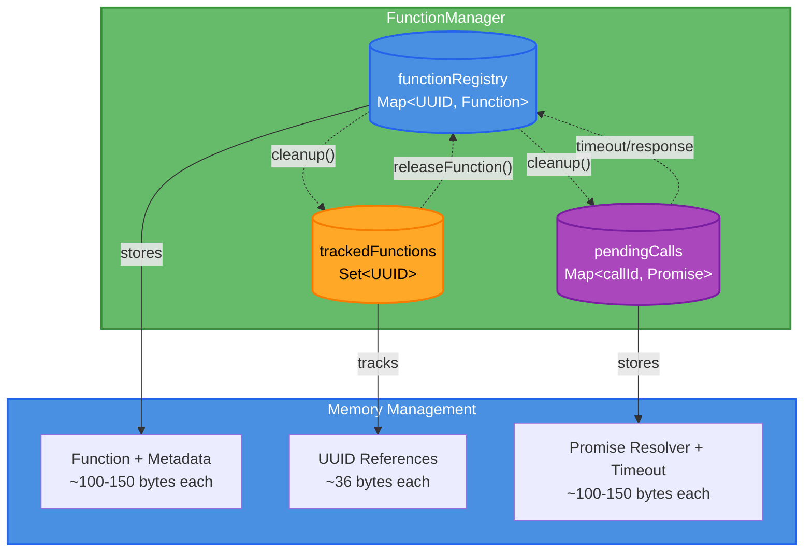
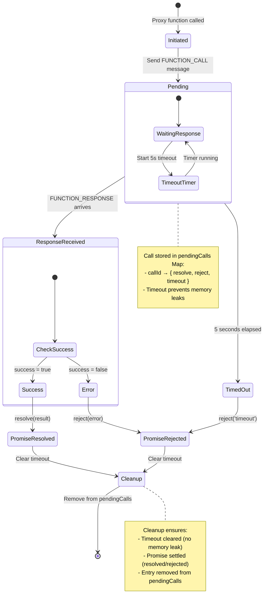

# Function Manager

The `FunctionManager` class manages function serialization, remote calls, and lifecycle for bidirectional RPC between parent and child frames.

## Overview

The `FunctionManager` centralizes all function-related logic:

* Serializes functions to UUID tokens
* Maintains function registry and tracks lifecycle
* Handles async remote function calls with timeout
* Manages cleanup on disconnect

Used by both `Frame` (parent) and `FrameSDK` (child).

### Architecture



The Function Manager maintains three core registries that work together to manage the complete lifecycle of remote function calls.

## Import

```typescript
import { FunctionManager } from '@zomme/frame';
```

## Constructor

### `FunctionManager(postMessage)`

Creates a new `FunctionManager` instance.

**Parameters:**

* `postMessage` (function) - Function to send messages: `(message: unknown, transferables?: Transferable[]) => void`

**Example:**

```typescript
// In Frame (parent)
const manager = new FunctionManager((message, transferables) => {
this._sendToIframe(message, transferables);
});

// In FrameSDK (child)
const manager = new FunctionManager((message, transferables) => {
this._sendToParent(message, transferables);
});
```

## Methods

### `serialize(value)`

Serialize a value (including functions and transferables).

**Parameters:**

* `value` (unknown) - Value to serialize

**Returns:** `{ serialized: unknown; transferables: Transferable[] }`

**Example:**

```typescript
const manager = new FunctionManager((msg) => console.log(msg));

const props = {
onSave: (data) => console.log('Saving:', data),
onCancel: () => console.log('Cancelled')
};

const { serialized, transferables } = manager.serialize(props);

console.log(serialized);
// {
//   onSave: { __fn: "uuid-1", __meta: { name: "onSave" } },
//   onCancel: { __fn: "uuid-2", __meta: { name: "onCancel" } }
// }

console.log(manager.getTrackedFunctions());
// ["uuid-1", "uuid-2"]
```

**Internals:**

Uses `serializeValue()` from [Serialization](./serialization.md) for details.

---

### `deserialize(value)`

Deserialize a value (creating proxy functions).

**Parameters:**

* `value` (unknown) - Value to deserialize

**Returns:** `unknown` - Deserialized value

**Example:**

```typescript
const manager = new FunctionManager((msg) => console.log(msg));

const serialized = {
onSave: { __fn: "abc-123", __meta: { name: "onSave" } }
};

// Add function to registry
manager._functionRegistry.set("abc-123", (data) => {
console.log('Executing onSave:', data);
return { success: true };
});

const deserialized = manager.deserialize(serialized);

// Call proxy function (will be forwarded to remote side)
console.log(typeof deserialized.onSave); // 'function'
```

**Internals:**

Uses `deserializeValue()` from [Serialization](./serialization.md) for details.

---

### `handleFunctionCall(callId, fnId, params)`

Handle incoming function call from remote side.

**Parameters:**

* `callId` (string) - Unique call identifier (for response)
* `fnId` (string) - Function UUID to call
* `params` (unknown) - Serialized parameters

**Behavior:**

1. Looks up function in registry
2. Deserializes parameters (may contain functions)
3. Calls function with deserialized params
4. Serializes result (may contain functions)
5. Sends `__FUNCTION_RESPONSE__` message

**Success Response:**

```json
{
"type": "__FUNCTION_RESPONSE__",
"callId": "call-456",
"success": true,
"result": { ... }
}
```

**Error Response:**

```json
{
"type": "__FUNCTION_RESPONSE__",
"callId": "call-456",
"success": false,
"error": "Error message"
}
```

**Example:**

```typescript
const manager = new FunctionManager((msg) => {
console.log('Sending:', msg);
});

// Register function
manager._functionRegistry.set("fn-123", async (id, data) => {
console.log('Called with:', id, data);
return { id, status: 'updated' };
});

// Handle incoming call
await manager.handleFunctionCall(
"call-456",
"fn-123",
[123, { name: 'John' }]
);

// Output:
// Sending: {
//   type: "__FUNCTION_RESPONSE__",
//   callId: "call-456",
//   success: true,
//   result: { id: 123, status: "updated" }
// }
```

**Error Handling:**

```typescript
// Function not found
await manager.handleFunctionCall("call-789", "fn-unknown", []);
// Sends error response: "Function not found: fn-unknown"

// Function throws error
manager._functionRegistry.set("fn-error", () => {
throw new Error('Something went wrong');
});

await manager.handleFunctionCall("call-999", "fn-error", []);
// Sends error response: "Something went wrong"
```

**Nested Functions in Parameters:**

```typescript
manager._functionRegistry.set("fn-callback", (callback) => {
// Callback is a proxy function from remote side
callback('Result!');
});

await manager.handleFunctionCall(
"call-001",
"fn-callback",
[{ __fn: "remote-callback", __meta: { name: "callback" } }]
);

// The callback is deserialized and called, sending a FUNCTION_CALL message
```

---

### Function Call Lifecycle



---

### `handleFunctionResponse(callId, success, result?, error?)`

Handle function call response from remote side.

**Parameters:**

* `callId` (string) - Call identifier (matches original `FUNCTION_CALL`)
* `success` (boolean) - Whether the call succeeded
* `result` (unknown, optional) - Serialized result (if success)
* `error` (string, optional) - Error message (if failed)

**Behavior:**

1. Looks up pending call in `_pendingFunctionCalls`
2. Clears timeout
3. Removes from pending calls
4. Resolves or rejects the pending promise

**Example:**

```typescript
const manager = new FunctionManager((msg) => console.log(msg));

// Simulate a pending call (created by proxy function)
const promise = new Promise((resolve, reject) => {
const timeout = setTimeout(() => reject(new Error('Timeout')), 5000);
manager._pendingFunctionCalls.set("call-123", {
  resolve,
  reject,
  timeout
});
});

// Handle success response
manager.handleFunctionResponse(
"call-123",
true,
{ data: 'Success!' }
);

const result = await promise;
console.log(result); // { data: 'Success!' }

// The timeout was cleared
```

**Error Response:**

```typescript
const promise = new Promise((resolve, reject) => {
const timeout = setTimeout(() => reject(new Error('Timeout')), 5000);
manager._pendingFunctionCalls.set("call-456", {
  resolve,
  reject,
  timeout
});
});

// Handle error response
manager.handleFunctionResponse(
"call-456",
false,
undefined,
'Invalid parameters'
);

try {
await promise;
} catch (error) {
console.log(error.message); // 'Invalid parameters'
}
```

**Timeout Handling:**

If timeout elapses before response:

```typescript
const promise = new Promise((resolve, reject) => {
const timeout = setTimeout(() => {
  manager._pendingFunctionCalls.delete("call-789");
  reject(new Error('Function call timeout: fn-123'));
}, 5000);
manager._pendingFunctionCalls.set("call-789", {
  resolve,
  reject,
  timeout
});
});

// Timeout after 5 seconds
try {
await promise;
} catch (error) {
console.log(error.message); // 'Function call timeout: fn-123'
}

// Even if response comes later, it's ignored
manager.handleFunctionResponse("call-789", true, { data: 'Too late' });
```

---

### `releaseFunction(fnId)`

Release a function from registry.

**Parameters:**

* `fnId` (string) - Function UUID to release

**Behavior:**

1. Removes function from `_functionRegistry`
2. Removes ID from `_trackedFunctions`

**Example:**

```typescript
const manager = new FunctionManager((msg) => console.log(msg));

// Register function
manager._functionRegistry.set("fn-1", () => {});
manager._trackedFunctions.add("fn-1");

console.log(manager._functionRegistry.has("fn-1")); // true
console.log(manager.getTrackedFunctions()); // ["fn-1"]

// Release function
manager.releaseFunction("fn-1");

console.log(manager._functionRegistry.has("fn-1")); // false
console.log(manager.getTrackedFunctions()); // []
```

**Cleanup on Property Change:**

```typescript
// Parent replaces function property
frame.onSave = newCallback;

// Old function is released
manager.releaseFunction("old-fn-id");

// New function is registered and tracked
const { serialized } = manager.serialize({ onSave: newCallback });
```

---

### `getTrackedFunctions()`

Get all tracked function IDs (for cleanup).

**Returns:** `string[]` - Array of tracked function UUIDs

**Example:**

```typescript
const manager = new FunctionManager((msg) => console.log(msg));

// Serialize multiple functions
manager.serialize({
onSave: () => {},
onCancel: () => {},
onValidate: () => {}
});

console.log(manager.getTrackedFunctions());
// ["uuid-1", "uuid-2", "uuid-3"]
```

**Use Case: Cleanup on Disconnect:**

```typescript
// Before closing connection
for (const fnId of manager.getTrackedFunctions()) {
port.postMessage({
  type: '__FUNCTION_RELEASE__',
  fnId
});
}

// Then close port
port.close();
```

---

### Method Interaction Flow

```mermaid
flowchart TD
    Start([Function Property Assignment])

    Start --> Serialize["serialize(value)"]
    Serialize --> StoreFunc["Store in functionRegistry<br/>(UUID → Function)"]
    StoreFunc --> TrackFunc["Add to trackedFunctions<br/>(Set of UUIDs)"]
    TrackFunc --> SendInit["Send to remote<br/>(via postMessage)"]

    SendInit --> RemoteReceive["Remote receives serialized value"]
    RemoteReceive --> Deserialize["deserialize(value)"]
    Deserialize --> CreateProxy["Create proxy function<br/>(returns Promise)"]

    CreateProxy --> ProxyCall["Proxy function invoked"]
    ProxyCall --> GenCallId["Generate callId"]
    GenCallId --> HandleCall["handleFunctionCall(callId, fnId, params)"]

    HandleCall --> LookupFunc["Look up fnId in functionRegistry"]
    LookupFunc --> DeserParams["Deserialize params<br/>(may contain functions)"]
    DeserParams --> ExecFunc["Execute function"]
    ExecFunc --> SerResult["Serialize result<br/>(may contain functions)"]
    SerResult --> SendResponse["Send FUNCTION_RESPONSE"]

    SendResponse --> HandleResponse["handleFunctionResponse(callId, success, result)"]
    HandleResponse --> LookupPending["Look up callId in pendingCalls"]
    LookupPending --> ClearTimeout["Clear timeout"]
    ClearTimeout --> ResolveReject{Success?}

    ResolveReject -->|Yes| Resolve["resolve(result)"]
    ResolveReject -->|No| Reject["reject(error)"]

    Resolve --> RemoveCall["Remove from pendingCalls"]
    Reject --> RemoveCall

    RemoveCall --> End1([Promise Settled])

    TrackFunc -.->|On disconnect| Cleanup["cleanup()"]
    Cleanup --> ReleaseAll["Release all tracked functions"]
    ReleaseAll --> ClearRegistry["Clear functionRegistry"]
    ClearRegistry --> ClearTracked["Clear trackedFunctions"]
    ClearTracked --> ClearPending["Clear pendingCalls<br/>(reject all with 'destroyed')"]
    ClearPending --> End2([Cleanup Complete])

    style Serialize fill:#4A90E2,stroke:#2563EB,stroke-width:2px,color:#fff
    style Deserialize fill:#4A90E2,stroke:#2563EB,stroke-width:2px,color:#fff
    style HandleCall fill:#FFA726,stroke:#F57C00,stroke-width:2px,color:#000
    style HandleResponse fill:#FFA726,stroke:#F57C00,stroke-width:2px,color:#000
    style Cleanup fill:#EF5350,stroke:#C62828,stroke-width:2px,color:#fff
    style CreateProxy fill:#AB47BC,stroke:#7B1FA2,stroke-width:2px,color:#fff
```



The diagram shows how the five main methods (`serialize`, `deserialize`, `handleFunctionCall`, `handleFunctionResponse`, `cleanup`) interact throughout the complete lifecycle of a function call.

---

### `cleanup()`

Clean up all resources.

**Behavior:**

1. **Clears ALL pending function call timeouts** - Prevents memory leaks from unresolved promises
2. Rejects all pending calls with error
3. Clears `_pendingFunctionCalls` map
4. Clears `_functionRegistry` map
5. Clears `_trackedFunctions` set

**CRITICAL:** Must be called when destroying the frame or parent component.

**Example:**

```typescript
const manager = new FunctionManager((msg) => console.log(msg));

// Simulate some pending calls
const call1 = new Promise((resolve, reject) => {
manager._pendingFunctionCalls.set("call-1", {
  resolve,
  reject,
  timeout: setTimeout(() => reject(), 5000)
});
});

const call2 = new Promise((resolve, reject) => {
manager._pendingFunctionCalls.set("call-2", {
  resolve,
  reject,
  timeout: setTimeout(() => reject(), 5000)
});
});

console.log(manager._pendingFunctionCalls.size); // 2

// Cleanup
manager.cleanup();

console.log(manager._pendingFunctionCalls.size); // 0
console.log(manager._functionRegistry.size);     // 0
console.log(manager._trackedFunctions.size);     // 0

// All pending promises are rejected
try {
await call1;
} catch (error) {
console.log(error.message); // 'FunctionManager destroyed'
}
```

**Integration with Frame Lifecycle:**

```typescript
// In ZFrame.disconnectedCallback()
disconnectedCallback() {
// Stop MutationObserver
this._observer?.disconnect();

// Release tracked functions
for (const fnId of this._manager.getTrackedFunctions()) {
  this._sendToIframe({
  type: '__FUNCTION_RELEASE__',
  fnId
  });
}

// Clean up function manager (clears ALL timeouts!)
this._manager?.cleanup();

// Close port
this._port?.close();

// Remove iframe
this._iframe?.remove();
}
```

```typescript
// In FrameSDK.cleanup()
cleanup() {
// Release tracked functions
for (const fnId of this._functionManager.getTrackedFunctions()) {
  this._sendToParent({
  type: '__FUNCTION_RELEASE__',
  fnId
  });
}

// Clean up function manager (clears ALL timeouts!)
this._functionManager?.cleanup();

// Clear event listeners
this._eventListeners.clear();

// Close port
this._port?.close();
}
```

## Complete Workflow Example

### Parent-Side Function Call

```typescript
import { FunctionManager } from '@zomme/frame';

// 1. Create manager in Frame
const manager = new FunctionManager((message, transferables) => {
this._sendToIframe(message, transferables);
});

// 2. Register function (property assignment)
frame.onSave = async (data) => {
const response = await fetch('/api/save', {
  method: 'POST',
  body: JSON.stringify(data)
});
return { success: response.ok };
};

// Internally:
// - Function is serialized to UUID
// - Stored in manager._functionRegistry
// - Tracked in manager._trackedFunctions

// 3. Parent receives FUNCTION_CALL from frame
async _handleMessage(message) {
if (message.type === '__FUNCTION_CALL__') {
  await manager.handleFunctionCall(
  message.callId,
  message.fnId,
  message.params
  );
  // Internally:
  // - Looks up function in registry
  // - Deserializes params
  // - Executes function
  // - Serializes result
  // - Sends FUNCTION_RESPONSE via postMessage
}
}
```

### Child-Side Function Call

```typescript
import { FunctionManager } from '@zomme/frame';

// 1. Create manager in FrameSDK
const manager = new FunctionManager((message, transferables) => {
this._sendToParent(message, transferables);
});

// 2. Receive props with functions (from INIT message)
this.props = manager.deserialize(message.payload);
// Functions are deserialized to proxy functions

// 3. Call parent function
try {
const result = await this.props.onSave({ name: 'John' });
console.log(result);
// Internally:
// - Proxy function generates callId
// - Sends FUNCTION_CALL message
// - Waits for FUNCTION_RESPONSE
// - Resolves promise with deserialized result
} catch (error) {
console.error('Function call failed:', error);
}

// 4. Handle response
async _handleMessage(message) {
if (message.type === '__FUNCTION_RESPONSE__') {
  manager.handleFunctionResponse(
  message.callId,
  message.success,
  message.result,
  message.error
  );
  // Internally:
  // - Looks up pending call
  // - Clears timeout
  // - Resolves or rejects promise
}
}
```

## Performance Considerations

### Memory Usage

Each function in registry consumes memory:

* Function object: ~50-100 bytes
* Function name metadata: ~20-50 bytes
* UUID token: ~36 bytes
* Pending call record: ~100-150 bytes

For 1000 functions: ~100-200KB.

**Best practice:** Release functions when no longer needed.

### Timeout Overhead

Each pending function call has a timeout timer (~1-2KB overhead):

* 10 pending calls: ~20KB
* 100 pending calls: ~200KB
* 1000 pending calls: ~2MB

**Best practice:** Cleanup promptly to prevent accumulation.

### Message Overhead

Each function call requires 2 messages:

1. FUNCTION_CALL (call initiation)
2. FUNCTION_RESPONSE (result/error)

**Latency:** ~1-2ms per message roundtrip (varies by environment).

**Best practice:** Batch operations to reduce message overhead.

## Security Considerations

### Origin Validation

FunctionManager relies on postMessage for communication. Always validate origin:

```typescript
// In Frame
window.addEventListener('message', (event) => {
if (event.origin !== this._origin) {
  console.error('Origin mismatch');
  return;
}
// Handle function calls
});
```

// In FrameSDK
await frameSDK.initialize('https://trusted-origin.com');
```

### Function Registry Limits

Registry size limit prevents DoS attacks:

```typescript
// Limit prevents excessive memory usage
const FUNCTION_REGISTRY_MAX_SIZE = 1000;

// If limit exceeded, new functions are not serialized
if (functionRegistry.size >= FUNCTION_REGISTRY_MAX_SIZE) {
console.error('Function registry limit exceeded');
return undefined;
}
```

### No Code Execution

Functions are called directly, never evaluated from strings:

```typescript
// SAFE: Function stored and called directly
manager._functionRegistry.set(fnId, (data) => {
console.log(data);
});

// SAFE: Call function from registry
const fn = manager._functionRegistry.get(fnId);
fn(data);

// NEVER uses eval or dynamic code evaluation
```

## Error Handling Best Practices

### Handle Timeout Errors

```typescript
try {
const result = await frameSDK.props.slowOperation();
} catch (error) {
if (error.message.includes('timeout')) {
  console.log('Operation timed out, retrying...');
  // Retry or fallback
} else {
  throw error;
}
}
```

### Handle Function Errors

```typescript
try {
const result = await frame.remoteFunction();
} catch (error) {
if (error.message.includes('not found')) {
  console.log('Function not available');
  // Fallback behavior
} else if (error.message.includes('disconnected')) {
  console.log('Frame disconnected');
  // Handle disconnect
} else {
  // Other error
  console.error('Function call failed:', error);
}
}
```

### Validate Function Results

```typescript
const result = await frame.validateData(data);

if (!result || typeof result !== 'object') {
throw new Error('Invalid result type');
}

if (!result.valid) {
console.log('Validation failed:', result.errors);
}
```

## Related

* **Serialization Module**: See [Serialization](./serialization.md) for low-level serialization details
* **Function Serialization**: See [Function Serialization](../advanced/function-serialization.md) for usage examples
* **SDK**: See [SDK](../references/sdk.md) for FrameSDK integration
* **Frame**: See [Frame](../references/frame.md) for Frame integration
* **Source Code**: `src/helpers/function-manager.ts`
